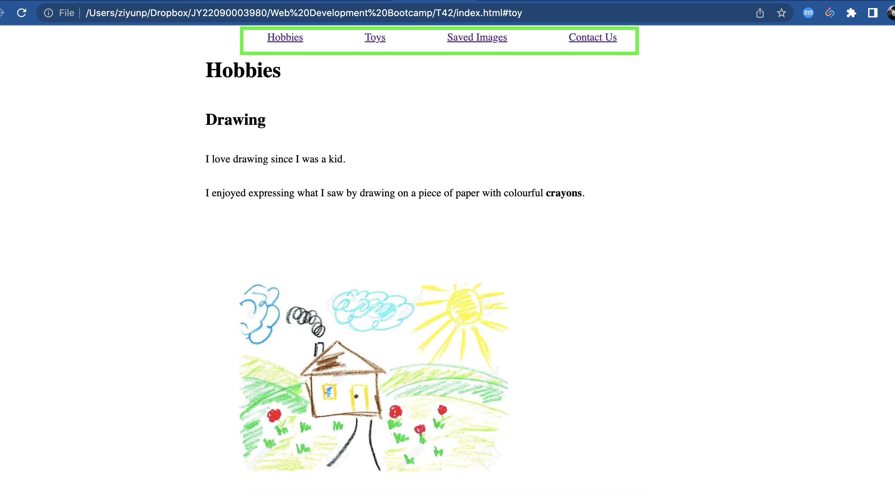
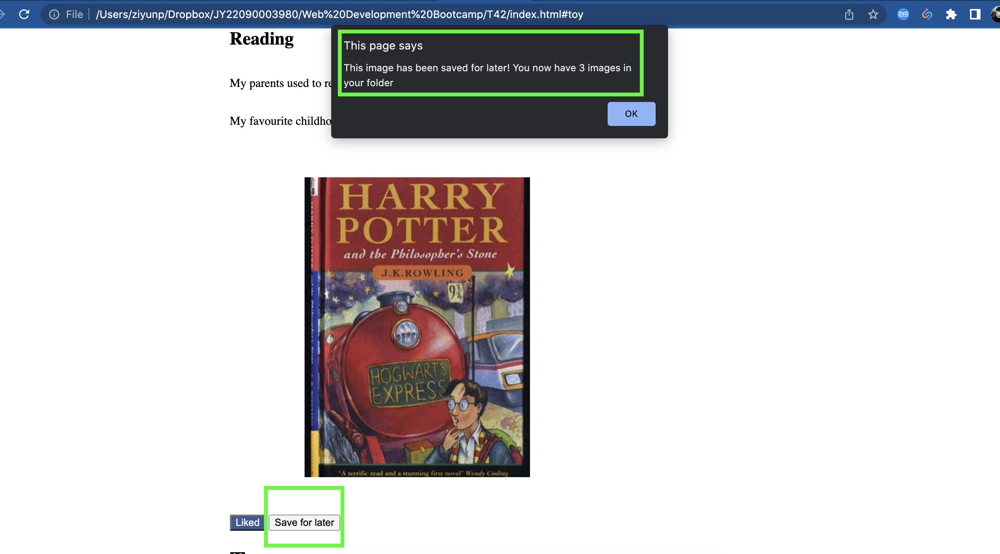

# finalCapstone

### Table Of Content

- [Top of page](#finalcapstone)
- [Project name](#project-name)
- [Project description](#description-of-project)
- [Installation](#installation)
- [Usage Instructions](#usage-instructions)

### Project Name

My Childhood

### Description of Project

- This project showcases my childhood's hobbies and favourite toys.
- The webpage allows users to save any images they like in a folder using local storage and revisit them on a separate browser window.
- The site also allows users to contact the author by entering their details using a form.

### Installation

Clone this repo and launch the index.html file in your browser.

### Usage Instructions

This is the `home page`. Users can navigate to different sections of the site by clicking on the items on the top bar.

Users can 'like' any of the article displayed on the webpage by clicking on the "like" button.

All the images can be saved and viewed in a separate window. Click on the "save for later button" and an alert will inform how many images have been saved.

By clicking the "Saved Images" button on top of the page, users can see all the images that have been saved and delete any of the images from the folder.

Users can send the author a message by clicking the "Contact Us" button at the top of page.
